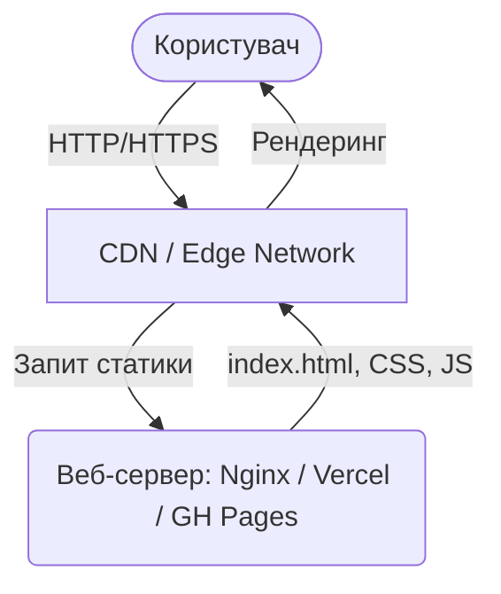

# Дослідження алгоритму "Розумних крапель води" для задачі комівояжера

Лендінг Бакалаврської роботи. Сумський державний університет, 2026.

## Опис

Проект являє собою односторінковий вебсайт-презентацію бакалаврської роботи на тему дослідження алгоритму Розумних крапель води (Intelligent Water Drops, IWD) для вирішення задачі комівояжера (Travelling Salesman Problem, TSP).

Задача комівояжера є класичною NP-складною проблемою комбінаторної оптимізації. Алгоритм IWD, натхненний природним процесом розмивання ґрунту водою, пропонує ефективний метаевристичний підхід до пошуку субоптимальних маршрутів у складних графах.

## Мета роботи

Розробка та аналіз програмної моделі алгоритму IWD для знаходження субоптимальних маршрутів у задачах на графах великої розмірності та порівняння результатів з мурашиним алгоритмом (ACO).

## Структура репозиторію

- index.html — головна сторінка сайту
- css/style.css — стилі сторінки
- js/main.js — скрипти (перемикач теми, анімації)
- img/ — зображення та іконки
- docs/structure.md — опис структури проекту
- favicon.svg — іконка сайту
- robots.txt — інструкції для пошукових систем
- sitemap.xml — карта сайту
- site.webmanifest — маніфест веб-програми
- package.json — залежності для інструментів розробки (stylelint)
- .gitignore — список файлів, що не відстежуються git
- .stylelintrc.json — конфігурація перевірки CSS

## Технології

HTML5, CSS3, JavaScript (Vanilla)

## Документування

У проєкті дотримуються наступні стандарти документування коду:

1.  **JavaScript**: Використовуйте стандарт **JSDoc**. Кожна функція повинна мати опис призначення, параметрів (`@param`) та значень, що повертаються (`@returns`). 
    - Більш детально дивіться у [docs/documentation.md](docs/documentation.md).
2.  **HTML/CSS**: Коментуйте основні секції та неочевидні рішення. В CSS документуйте призначення Custom Properties (`--variable`).
3.  **Markdown**: Всі файли в теці `docs/` повинні мати заголовок першого рівня та чітку структуру.

Для автоматичної генерації документації з JS-коду рекомендується використовувати інструмент **jsdoc-to-markdown** або базовий **JSDoc**.

## Архітектура проекту

Проект є повністю статичним веб-застосунком (Landing Page), тому він не потребує складних серверних рішень для розгортання та роботи. 

*Примітка для викладача: Оскільки це статичний сайт на HTML/CSS/JS (збірка через Vite), компоненти на кшталт Application Server, СУБД, Файлове сховище та Сервіси кешування (Redis/Memcached) не застосовуються за типом проекту. Альтернативою виступає використання CDN для пришвидшення доставки статики та браузерного кешування.*

### Структурні елементи:
- **Клієнтська частина (Frontend):** HTML, CSS, JS.
- **Веб-сервер:** Під час розробки — Vite Dev Server. У продакшені — статичний файловий сервер (наприклад, Nginx, або платформи як GitHub Pages, Vercel, Netlify).
- **СУБД / Application Server:** Не застосовуються (відсутня динамічна серверна логіка).
- **Кешування:** CDN або кешування на рівні веб-сервера у продакшені.

### Діаграма архітектури



## Інструкція для розробників (Onboarding)

Нижче наведено кроки для нових розробників на випадок "чистої" ОС.

### 1. Необхідне програмне забезпечення
Перед початком роботи переконайтеся, що на вашому комп'ютері встановлено:
- **Git:** система контролю версій ([завантажити Git](https://git-scm.com/)).
- **Node.js:** (включає `npm`) для управління залежностями та запуску скриптів — рекомендована версія 20.x або вище ([завантажити Node.js](https://nodejs.org/)).
- **Редактор коду:** наприклад, [Visual Studio Code](https://code.visualstudio.com/).

### 2. Клонування репозиторію
Відкрийте термінал (або командний рядок) та виконайте наступні команди:
```bash
# Клонувати репозиторій
git clone https://github.com/Enamored321/tpp.git

# Перейти до теки проекту
cd tpp
```

### 3. Встановлення залежностей
Оскільки проект використовує Node.js для інструментарію розробки (Vite, ESLint, Stylelint), встановіть всі залежності:
```bash
npm install
```

*Створення та налаштування бази даних не потрібне, оскільки проект є статичним сайтом.*

### 4. Запуск у режимі розробки
Для локального запуску проекту з підтримкою "гарячого" перезавантаження використовується Vite:
```bash
npm run dev
```
Після цього відкрийте браузер за адресою, підказаною в терміналі (зазвичай `http://localhost:5173`).

### 5. Базові команди
- `npm run build` — оптимізація та збирання проекту для production у теку `dist/`.
- `npm run preview` — попередній перегляд зібраного production-білду.
- `npm run lint` — перевірка якості коду (JS, CSS, HTML).
- `npm run format` — автоматичне форматування коду за допомогою Prettier.

## Автор

Горовий Богдан, студент групи ІН-26-3
